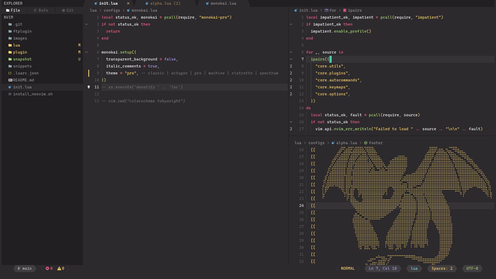
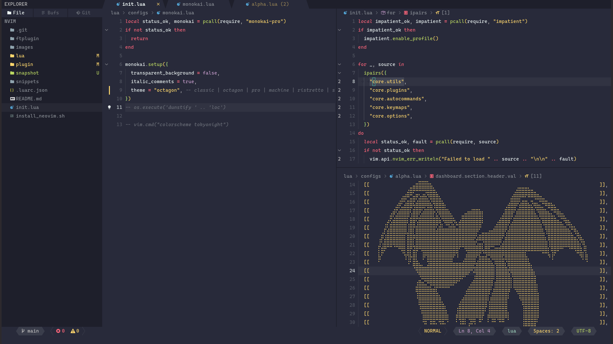
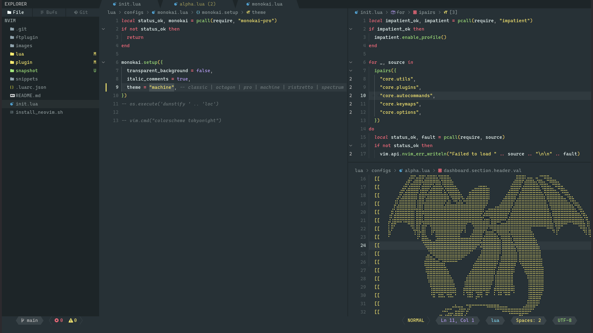
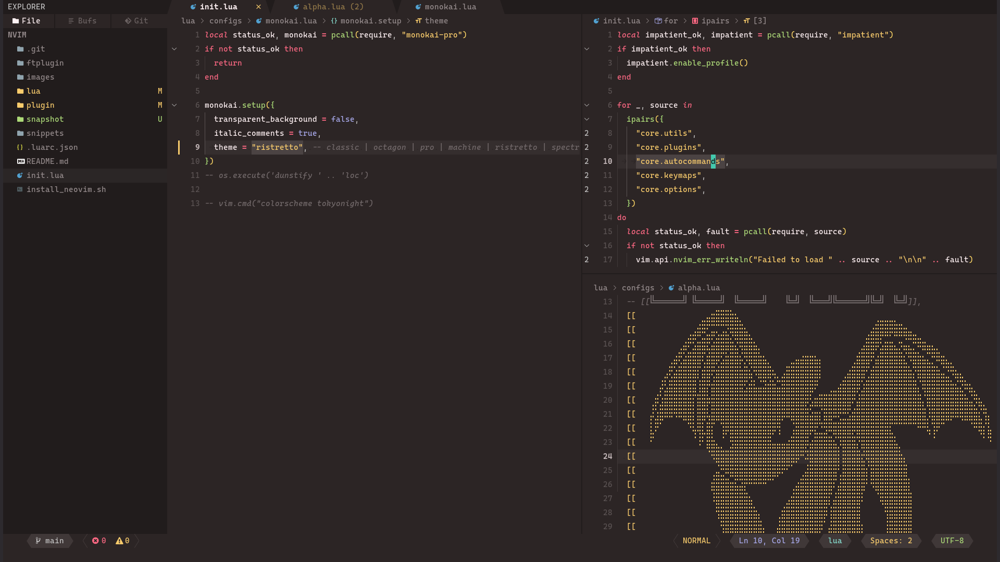
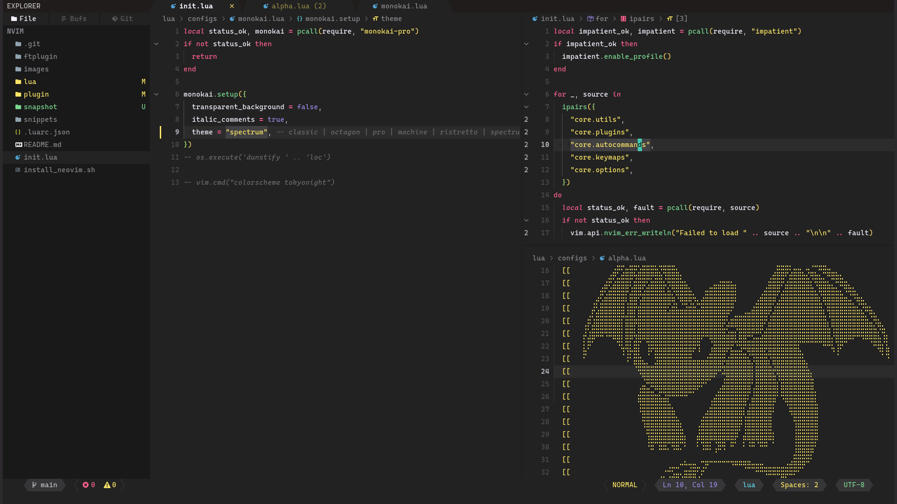
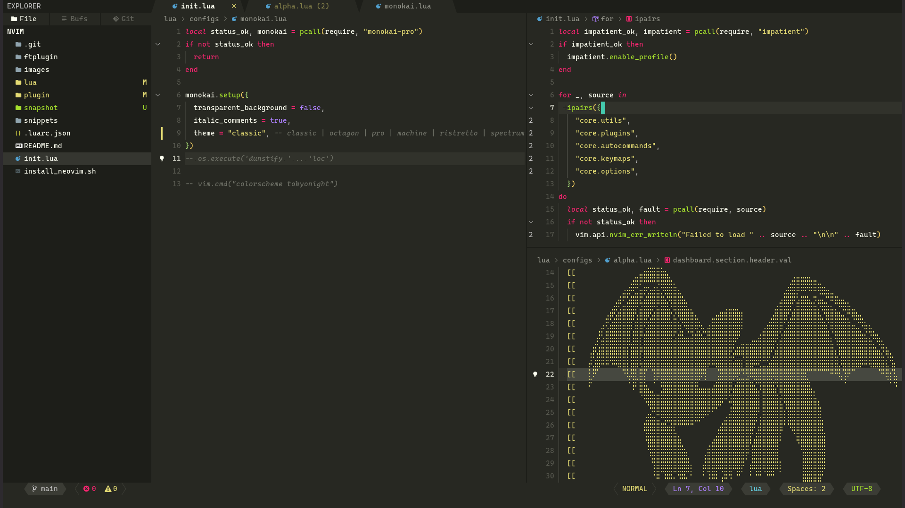

<div align="center">
    <div class="b-header">
        <a class="active" href="https://github.com/loctvl842/monokai-pro.nvim">
            
            <h1>Monokai Pro</h1>
            <h2>Beautiful functionality for professional developers</h2>
        </a>
    </div>
</div>

Credit goes to the original creator [Monokai Pro](https://monokai.pro/)

## 📦 Installation

```lua
use("loctvl842/monokai-pro.nvim")
```

## ⚙️ Configuration

## Config

There are several themes included in this plugin.

- [Pro](#Pro) – Monokai Pro _(default)_
- [Octagon](#Octagon) – Monokai Pro (Filter Octagon)
- [Machine](#Machine) – Monokai Pro (Filter Machine)
- [Ristretto](#Ristretto) – Monokai Pro (Filter Machine)
- [Spectrum](#Spectrum) – Monokai Pro (Filter Machine)
- [Classic](#Classic) – Monokai Classic

Example configuration:

```lua
require("monokai-pro").setup({
	transparent_background = false, -- better set to false
	italic_comments = true,
	theme = "octagon", -- classic | octagon | pro | machine | ristretto | spectrum
	diagnostic = {
		background = true, -- highlight background of diagnostic
	},
    plugins = {
        bufferline = {
            underline_selected = true, -- better set `false` if you don't use kitty terminal
        }
    }
})
```

## Plugin support

- [Alpha](https://github.com/goolord/alpha-nvim)
- [BufferLine](https://github.com/akinsho/bufferline.nvim)
- [Cmp](https://github.com/hrsh7th/nvim-cmp)
- [Illuminate](https://github.com/RRethy/vim-illuminate)
- [IndentBlankline](https://github.com/lukas-reineke/indent-blankline.nvim)
- [NeoTree](https://github.com/nvim-neo-tree/neo-tree.nvim)
- [Notify](https://github.com/rcarriga/nvim-notify)
- [Renamer](https://github.com/filipdutescu/renamer.nvim)
- [Lualine](https://github.com/nvim-lualine/lualine.nvim)
- [Telescope](https://github.com/nvim-telescope/telescope.nvim)
- [toggleterm](https://github.com/akinsho/toggleterm.nvim)
- [Treesitter](https://github.com/nvim-treesitter/nvim-treesitter)
- [Whichkey](https://github.com/folke/which-key.nvim)
- [breadcrumb](https://github.com/loctvl842/breadcrumb.nvim)

## Pro



## Octagon



## Machine



## Ristretto



## Spectrum



## Classic



## TODO

- [ ] Fix icons in bufferline
- [ ] options for border in Telescope (float, get_theme)
- [ ] options for border in NeoTree
- [ ] options for border in cmp
- [ ] options for border session-lens
- [ ] fix bufferlineCloseButtonVisible
- [ ] fix lualine theme
- [ ] options for border in whichkey
